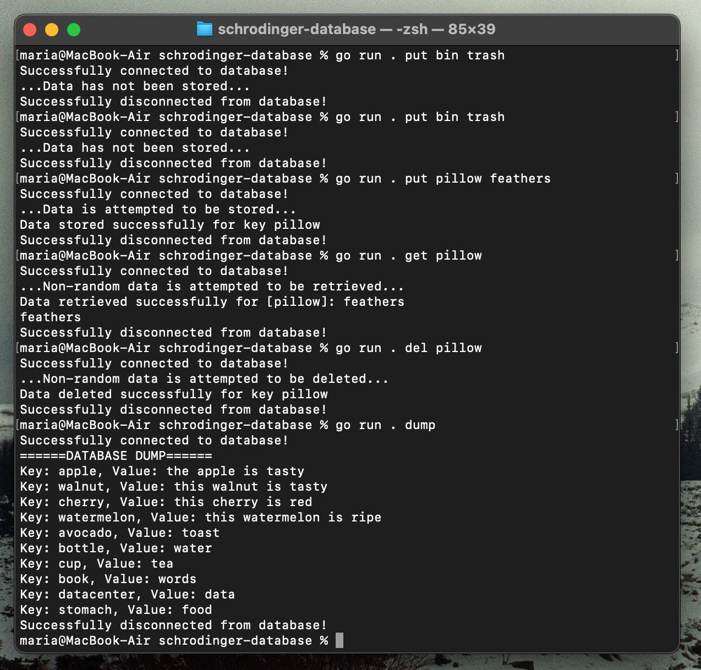

# Schrödinger's Database 🐱📦

A key-value store built in Go that **randomly breaks** — sometimes returning the wrong data or failing mysteriously. 

## Features
- Store, retrieve, and delete key-value pairs.
- List all stored key-value pairs.
- Randomized behavior to mimic "unstable" database responses.
- Simple CLI powered by [Cobra](https://github.com/spf13/cobra).
- PostgreSQL backend connection with `.env` configuration.

## Installation
```bash
git clone https://github.com/rodopiip/schrodinger-db.git

cd <repo-folder>

docker build -t schrodinger-db .

docker run -it --rm schrodinger-db
```

## Shcrodinger CLI Commands
```bash
# Store a value
go run . put mykey myvalue

# Retrieve a value
go run . get mykey

# Delete a value
go run . del mykey

# Dump all values
go run . dump

# Show help
go run . --help

```
### CLI Showcase
